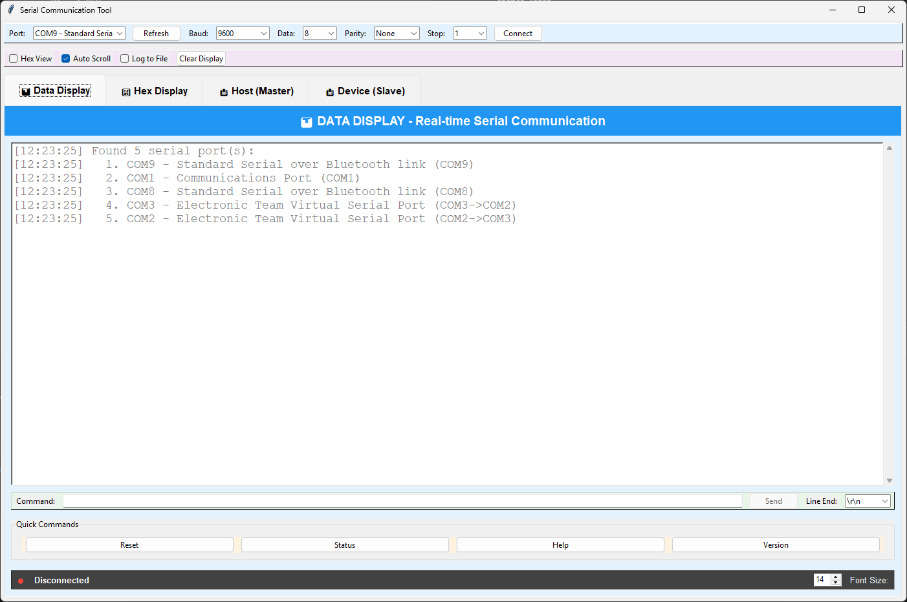
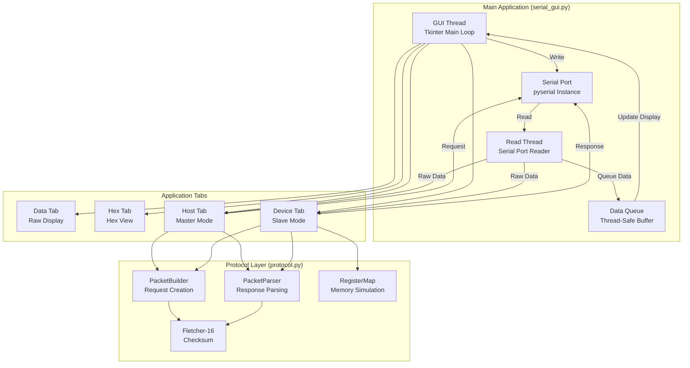
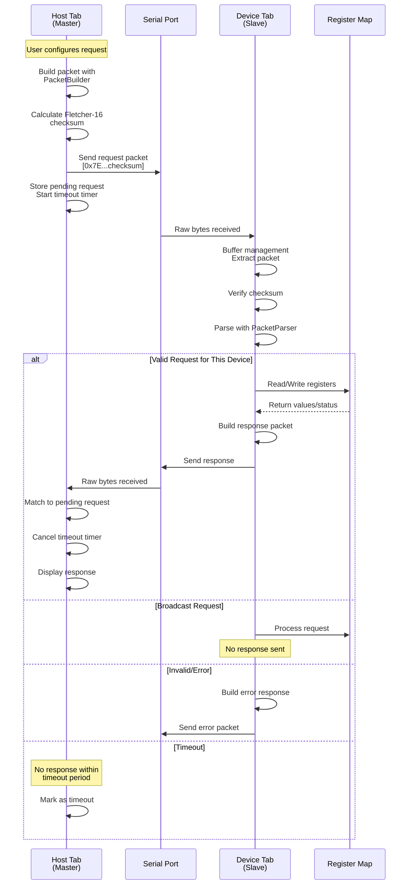
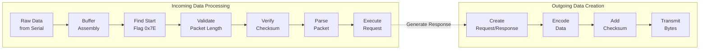
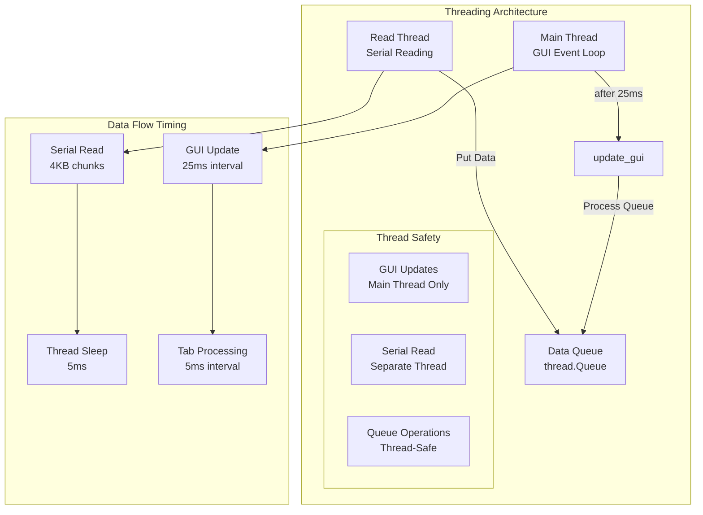
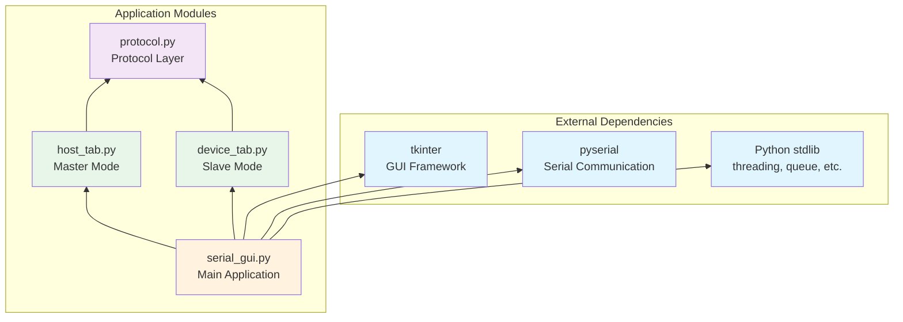

# PySerial GUI Communication Tool


A comprehensive cross-platform serial communication GUI application built with Python and Tkinter, featuring a custom register-based communication protocol for embedded systems testing and development.

## 📸 Application Screenshots

### Data Display Tab

*Real-time serial communication with hex/ASCII views, command history, and data logging*

### Host (Master) Mode
.png)
*Send register read/write commands with packet preview and response monitoring*

### Device (Slave) Mode
.png)
*Simulate devices with configurable register maps, error simulation, and communication logging*

## 🚀 Features

### Core Functionality
- ✅ **Cross-platform serial communication** (Windows, macOS, Linux)
- ✅ **Non-blocking I/O** - GUI remains responsive during operations
- ✅ **Real-time data display** with auto-scrolling
- ✅ **Hex and ASCII views** for data analysis
- ✅ **Command history** with Up/Down arrow navigation
- ✅ **Data logging** to timestamped CSV files
- ✅ **Quick command macros** for frequently used commands

### Advanced Protocol Support
- 🔥 **Host (Master) Mode** - Send register read/write commands
- 🔥 **Device (Slave) Mode** - Simulate device with configurable register map
- 🔥 **Fletcher-16 checksum** verification for data integrity
- 🔥 **Error simulation** for robust testing
- 🔥 **Broadcast messaging** support
- 🔥 **Timeout handling** with configurable delays

### UI/UX Features
- 🎨 **Optimized Layout** - Tab-specific controls moved inside tabs for better space utilization
- 🎨 **Real-time Monitoring** - Separate panels for incoming requests and outgoing responses with 14pt font for better readability
- 🎨 **Visual Feedback** - Packet counters in panel headers, auto-scroll toggles, search functionality, register highlighting
- 🎨 **Enhanced Device Tab** - Reorganized Error Simulation (3-column layout), register map with search and tooltips
- 🎨 **Improved Host Tab** - Expanded Packet Preview section with color-coded formatting, optimized parameter fields with better labeling
- 🎨 **Color-Coded Packet Preview** - Syntax highlighting for hex bytes, labels, values, function codes, and addresses for better readability
- 🎨 **Responsive Design** - Each tab is self-contained with all relevant controls integrated

## 📁 Project Structure

```
PySerial_GUI_Project/
├── README.md                   # Project documentation (this file)
├── dev_note.md                # Development notes and implementation details
├── requirements.txt           # Python dependencies
├── serial_gui.py             # Main application entry point
├── protocol.py               # Communication protocol implementation
├── host_tab.py              # Host/Master mode implementation
├── device_tab.py            # Device/Slave mode implementation
├── test_protocol.py         # Protocol testing and validation
├── test_port_detection.py   # Serial port detection testing
├── create_ports.sh          # Virtual port creation script (macOS/Linux)
└── start_virtual_ports.sh   # Legacy virtual port script
```

### File Descriptions

| File | Purpose | Key Components |
|------|---------|----------------|
| `serial_gui.py` | Main GUI application | SerialGUI class, port detection, UI management |
| `protocol.py` | Protocol implementation | Packet encoding/decoding, Fletcher-16, RegisterMap |
| `host_tab.py` | Master mode interface | Command sending, response handling, timeout management |
| `device_tab.py` | Slave mode simulator | Register map, request processing, error simulation |
| `test_protocol.py` | Testing suite | Automated protocol verification and examples |

## 🔄 Application Architecture & Data Flow

### System Architecture Overview



### Protocol Communication Flow



### Packet Processing Pipeline



### Threading Model & Synchronization



### Module Dependencies



## 📡 Communication Protocol

### Protocol Overview
The application implements a custom frame-based protocol designed for reliable register-based communication with embedded devices.

### Packet Structure
```
┌─────────────┬─────────────┬─────────────┬─────────────┬─────────────┬─────────────┐
│ Start Flag  │ Device Addr │ Message ID  │ Length [N]  │ Data [N]    │ Checksum    │
│   (1 byte)  │   (1 byte)  │   (1 byte)  │   (1 byte)  │  (N bytes)  │  (2 bytes)  │
│    0x7E     │   0-247     │   0-255     │   0-255     │ Func + Data │ Fletcher-16 │
└─────────────┴─────────────┴─────────────┴─────────────┴─────────────┴─────────────┘
```

### Function Codes

#### Host → Device (Requests)
| Code | Function | Parameters |
|------|----------|------------|
| 0x01 | Read Single Register | Register Address (2 bytes) |
| 0x02 | Write Single Register | Register Address (2 bytes) + Value (2 bytes) |
| 0x03 | Read Multiple Registers | Register Address (2 bytes) + Count (1 byte) |
| 0x04 | Write Multiple Registers | Register Address (2 bytes) + Count (1 byte) + Values (2×Count bytes) |

#### Device → Host (Responses)
| Code | Function | Parameters |
|------|----------|------------|
| 0x41 | Read Single Response | Register Address (2 bytes) + Value (2 bytes) |
| 0x42 | Write Single Response | Register Address (2 bytes) + Value (2 bytes) |
| 0x43 | Read Multiple Response | Register Address (2 bytes) + Count (1 byte) + Values (2×Count bytes) |
| 0x44 | Write Multiple Response | Register Address (2 bytes) + Count (1 byte) |

#### Error Responses
| Code | Function | Error Code |
|------|----------|------------|
| 0x81-0x84 | Error Response | Error Code (1 byte) |

### Error Codes
- `0x01` - Invalid or unsupported function
- `0x02` - Invalid register address  
- `0x03` - Invalid register value
- `0xFF` - Internal/unspecified error

### Example Packet
**Read Single Register at address 0x1234:**
```
7E 01 10 03 01 12 34 2F D9
│  │  │  │  │  │  │  │  │
│  │  │  │  │  │  │  └──┴─ Fletcher-16 checksum (0x2FD9)
│  │  │  │  │  └──┴─────── Register address (0x1234)
│  │  │  │  └──────────── Function code (0x01 - Read Single)
│  │  │  └─────────────── Length (3 bytes of data)
│  │  └────────────────── Message ID (0x10)
│  └───────────────────── Device address (1)
└──────────────────────── Start flag (0x7E)
```

## 🛠️ Installation & Setup

### Prerequisites
- **Python 3.7 or higher**
- **tkinter** (included with most Python installations)
  - Linux: `sudo apt-get install python3-tk` (if needed)
- **pyserial** library

### Installation Steps

1. **Clone or download the project:**
   ```bash
   git clone <repository-url>
   cd PySerial_GUI_Project
   ```

2. **Install dependencies:**
   ```bash
   pip install -r requirements.txt
   ```
   Or manually:
   ```bash
   pip install pyserial
   ```

3. **Run the application:**
   ```bash
   python serial_gui.py
   ```

### Platform-Specific Setup

#### macOS
- Install Homebrew (if not already installed)
- Install socat for virtual ports: `brew install socat`

#### Linux
- Add user to dialout group: `sudo usermod -a -G dialout $USER`
- Install socat: `sudo apt-get install socat` (Ubuntu/Debian)
- Log out and back in for group changes to take effect

#### Windows
- No additional setup required
- Virtual ports can be created using com0com or similar tools

## 🎮 Usage Guide

### Basic Serial Communication

1. **Launch the application:**
   ```bash
   python serial_gui.py
   ```

2. **Connect to a device:**
   - Select serial port from dropdown (click Refresh to scan)
   - Choose baud rate (default: 9600)
   - Configure data bits, parity, stop bits as needed
   - Click "Connect"

3. **Send/receive data:**
   - **Data Display tab**: View incoming data in real-time
   - **Hex Display tab**: View data in hexadecimal format
   - Type commands in the input field and press Enter or click Send


### Protocol Testing Mode

#### Host (Master) Mode
Use this mode to send register commands to a device:

.png)

1. **Switch to "Host (Master)" tab**
2. **Configure device address** (1-247, or 0 for broadcast)
3. **Select operation type:**
   - Read Single (0x01)
   - Write Single (0x02)  
   - Read Multiple (0x03)
   - Write Multiple (0x04)
4. **Enter parameters:**
   - Register address (hex format, e.g., "0010")
   - Values as needed for write operations
5. **Preview packet** in the color-coded Packet Preview & Inspection section
   - Hex bytes shown in blue bold
   - Parsed fields with color-coded labels, values, and function codes
   - Real-time updates as you modify parameters
6. **Click "Send Request"**
7. **Monitor response** in the Communication Log with expanded Packet Preview section

#### Device (Slave) Mode  
Use this mode to simulate a device:

.png)

1. **Switch to "Device (Slave)" tab**
2. **Configure device settings:**
   - Set device address (1-247) and register map size in the compact Device Configuration panel
   - Click "Test Pattern" to load sample data or "Clear" to reset registers
3. **Set up error simulation:** Choose from 5 error types in the 3-column layout (No Error, Invalid Function, Invalid Address, Invalid Value, Internal Error)
4. **Monitor communication:**
   - **Incoming Requests**: View detailed logs with packet counters and auto-scroll toggle
   - **Outgoing Responses**: Monitor sent responses with search functionality
   - **Statistics**: Track request/response/error counts with reset functionality
5. **Edit registers:** Use the Register Map section with enhanced search, tooltips, and "Set Multiple" functionality (comma-separated values)

### Virtual Port Testing

For testing without hardware, create virtual serial port pairs:

#### macOS/Linux:
```bash
# Create virtual ports
./create_ports.sh

# In terminal 1 (Device):
python serial_gui.py
# Connect to first virtual port (e.g., /dev/ttys006)
# Go to Device tab, set address 1, load test pattern

# In terminal 2 (Host):  
python serial_gui.py
# Connect to second virtual port (e.g., /dev/ttys007)
# Go to Host tab, send commands to address 1
```

#### Windows:
- Install com0com or similar virtual port software
- Create a COM pair (e.g., COM10 ↔ COM11)
- Use same procedure as above with Windows COM ports

## 🧪 Testing

### Protocol Validation
Run the comprehensive test suite:
```bash
python test_protocol.py
```

This tests:
- Fletcher-16 checksum calculation
- Packet encoding/decoding
- Register map operations  
- Error response generation
- Full request-response cycles

### Port Detection Testing
Check what serial ports are detected:
```bash
python test_port_detection.py
```

### Manual Testing Scenarios

1. **Basic Communication Test:**
   - Host sends Read Single (0x01) to register 0x0000
   - Device responds with current value

2. **Write Operation Test:**
   - Host sends Write Single (0x02) with value 0x1234
   - Device updates register and confirms

3. **Multiple Register Test:**
   - Host sends Read Multiple (0x03) for 4 registers
   - Device returns array of values

4. **Error Handling Test:**
   - Enable error simulation in Device tab
   - Host receives error responses with appropriate codes

5. **Broadcast Test:**
   - Host sends to address 0 (broadcast)
   - Device processes but doesn't respond

## 🔧 Development

### Architecture Overview
The application uses a modular architecture with clear separation of concerns:

- **GUI Layer** (`serial_gui.py`): Tkinter interface and event handling
- **Protocol Layer** (`protocol.py`): Packet encoding/decoding and validation  
- **Application Layer** (`host_tab.py`, `device_tab.py`): Business logic
- **Communication Layer**: Threading and queue-based serial I/O

### Threading Model
- **Main Thread**: GUI updates and event handling
- **Read Thread**: Non-blocking serial data reading with improved reliability
- **Queue-based**: Thread-safe communication via `queue.Queue`
- **Periodic Updates**: GUI refreshes every 25ms using `root.after()` for better responsiveness
- **Enhanced Data Capture**: Always-on reading strategy eliminates race conditions

### Extending the Protocol

#### Adding New Function Codes:
1. Update `FunctionCode` enum in `protocol.py`
2. Add packet builders in `PacketBuilder` class
3. Add parsers in `PacketParser` class  
4. Update UI in host/device tabs
5. Add test cases in `test_protocol.py`

#### Custom Register Types:
```python
class CustomRegisterMap(RegisterMap):
    def __init__(self):
        super().__init__(size=512)
        # Add custom register behaviors
        
    def read(self, address):
        # Custom read logic
        return super().read(address)
```

### Code Style Guidelines
- **PEP 8** compliance
- **Type hints** for function parameters and returns
- **Docstrings** for all public methods
- **Error handling** with specific exception types
- **Resource cleanup** in finally blocks

## 🐛 Troubleshooting

### Common Issues

#### "Port not found" or "Access denied"
- **Linux**: Add user to dialout group: `sudo usermod -a -G dialout $USER`  
- **macOS**: Check port permissions: `ls -la /dev/tty*`
- **Windows**: Check device manager for COM port conflicts

#### GUI freezing during operations
- This should not occur with the current implementation
- If it does, check that threading is properly implemented
- Verify `timeout=0` is set on serial port

#### Data reception issues or missing packets
- **Fixed in v2.1**: Improved serial reading eliminates race conditions
- Uses continuous polling instead of `in_waiting` checks
- Faster response times (5ms polling, 25ms GUI updates)
- Should no longer require sending data multiple times

#### Virtual ports not visible in GUI
- Click the "Refresh" button to rescan ports
- Check that virtual ports exist: `ls -la /dev/ttys*`
- Verify socat is running: `ps aux | grep socat`

#### Protocol checksum errors
- Verify Fletcher-16 implementation matches specification
- Check byte order (big-endian) for multi-byte values
- Use `test_protocol.py` to validate checksum calculation

#### Device not responding in slave mode
- Check device address matches between Host and Device tabs
- Verify serial connection is established on both instances
- Check for firewall or permission issues

### Debug Mode
Enable detailed logging by modifying the main application:
```python
import logging
logging.basicConfig(level=logging.DEBUG)
```

### Performance Tuning
- **Current optimized settings**: 
  - GUI update interval: 25ms (`self.root.after(25, ...)`)
  - Read thread polling: 5ms delay
  - Tab processing: 5ms intervals
- Modify serial buffer sizes for high-throughput applications (current: 4KB buffer)
- Tune timeout values in host tab for faster/slower devices
- **Data Reception Improvements (v2.1)**:
  - Eliminated race conditions in serial reading
  - Continuous polling strategy for reliable data capture
  - Reduced timing delays for better responsiveness

## 📈 Future Enhancements

### Planned Features
- [ ] **Scripting Interface**: Python script execution for automated testing
- [ ] **Plugin Architecture**: Loadable modules for custom protocols  
- [ ] **Data Visualization**: Real-time plotting of register values
- [ ] **Configuration Profiles**: Save/load device configurations
- [ ] **Remote Access**: Network-based device access
- [ ] **Firmware Updates**: Over-the-air update capabilities

### Contributing
1. Fork the repository
2. Create a feature branch
3. Add tests for new functionality
4. Ensure all tests pass
5. Submit a pull request with detailed description

## 📄 License

This project is licensed under the MIT License - see the LICENSE file for details.

## 🤝 Acknowledgments

- **PySerial** library developers for excellent serial communication support
- **Tkinter** for providing a robust cross-platform GUI framework
- **socat** developers for virtual serial port capabilities
- **Fletcher checksum** algorithm for reliable data integrity

## 📞 Support

For issues, questions, or contributions:
- Create an issue in the project repository
- Check the troubleshooting section above
- Review the development notes in `dev_note.md`

---

**Happy Testing!** 🚀