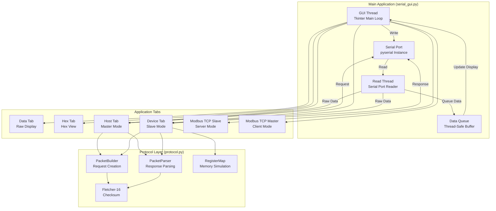
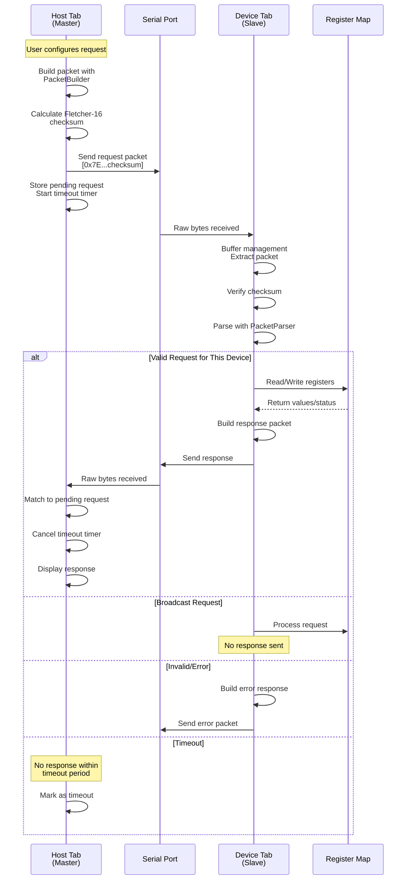
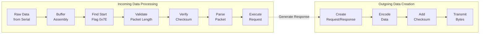
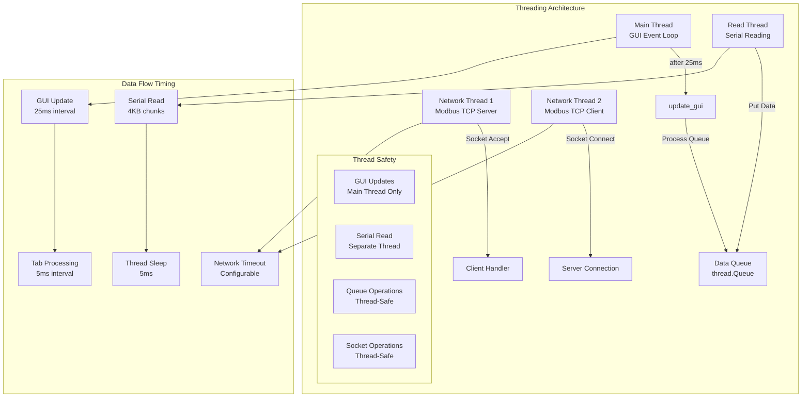
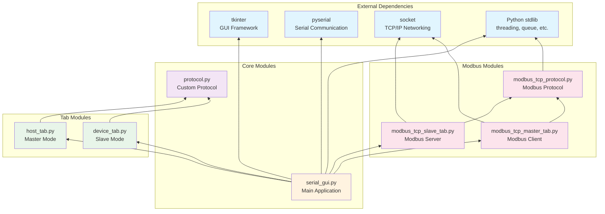

# SerialCOM Tool - Professional Serial & Network Communication Suite


A comprehensive cross-platform communication tool for serial and network protocols, featuring advanced debugging capabilities for embedded systems development and testing.

## Table of Contents
- [Overview](#overview)
- [Key Features](#key-features)
- [Screenshots](#screenshots)
- [Installation](#installation)
- [Quick Start](#quick-start)
- [Communication Protocols](#communication-protocols)
  - [Serial Communication](#serial-communication)
  - [Custom Protocol](#custom-protocol)
  - [Modbus TCP](#modbus-tcp)
- [Usage Guide](#usage-guide)
- [Testing](#testing)
- [Architecture](#architecture)
- [Development](#development)
- [Troubleshooting](#troubleshooting)
- [License](#license)

## Overview

SerialCOM Tool is a professional-grade communication suite designed for engineers and developers working with embedded systems, industrial automation, and IoT devices. It provides a unified interface for multiple communication protocols with real-time monitoring, data logging, and protocol analysis capabilities.

## Key Features

### Core Capabilities
- **Multi-Protocol Support**: Serial, Custom Register-based Protocol, Modbus TCP
- **Cross-Platform**: Native support for Windows, macOS, and Linux
- **Real-Time Monitoring**: Live data visualization with hex/ASCII views
- **Non-Blocking I/O**: Responsive GUI during all operations
- **Data Logging**: Timestamped CSV export for analysis
- **Protocol Analysis**: Packet inspection, checksum verification, error detection

### Communication Features
- **Serial Communication**: Full RS-232/485 support with hardware flow control
- **Master/Slave Modes**: Act as either host (master) or device (slave)
- **Modbus TCP**: Server and client implementation with 16-bit register support
- **Error Simulation**: Test error handling and edge cases
- **Broadcast Support**: One-to-many communication capability
- **Timeout Management**: Configurable timeouts with automatic retry

### User Interface
- **Tabbed Interface**: Organized workspace for different protocols
- **Color-Coded Display**: Visual differentiation of data types and packet components
- **Search Functionality**: Quick data location in logs and registers
- **Command History**: Arrow-key navigation through previous commands
- **Auto-Scroll Control**: Manageable real-time data streams
- **Responsive Design**: Optimized layout for various screen sizes

## Screenshots

### Data Display Tab

*Real-time serial communication with hex/ASCII views and command history*

### Host (Master) Mode
.png)
*Send register commands with packet preview and response monitoring*

### Device (Slave) Mode
.png)
*Simulate devices with configurable register maps and error simulation*

### Modbus TCP Slave

*TCP server for Modbus communication with register management*

### Modbus TCP Master

*TCP client for sending Modbus requests with real-time packet preview*

## Installation

### Prerequisites
- Python 3.7 or higher
- tkinter (usually included with Python)
- pyserial library

### Setup Instructions

#### Method 1: Using Virtual Environment (Recommended)

**Step 1: Clone the repository**
```bash
git clone <repository-url>
cd SerialCOM_Tool
```

**Step 2: Create and activate virtual environment**

**Windows:**
```bash
# Create virtual environment
python -m venv venv

# Activate virtual environment
venv\Scripts\activate

# You should see (venv) in your command prompt
```

**macOS/Linux:**
```bash
# Create virtual environment
python3 -m venv venv

# Activate virtual environment
source venv/bin/activate

# You should see (venv) in your terminal prompt
```

**Step 3: Install dependencies**
```bash
# With virtual environment activated
pip install -r requirements.txt
```

**Step 4: Run the application**
```bash
# With virtual environment activated
python serial_gui.py
```

**Step 5: Deactivate virtual environment (when done)**
```bash
deactivate
```

#### Method 2: System-wide Installation (Alternative)

1. **Clone the repository**
   ```bash
   git clone <repository-url>
   cd SerialCOM_Tool
   ```

2. **Install dependencies**
   ```bash
   pip install -r requirements.txt
   ```

3. **Run the application**
   ```bash
   python serial_gui.py
   ```

### Virtual Environment Benefits

Using a virtual environment provides several advantages:

- **Isolation**: Dependencies are isolated from your system Python
- **Reproducibility**: Consistent environment across different machines
- **Version Control**: Specific package versions without conflicts
- **Clean Uninstall**: Easy to remove by deleting the venv folder
- **Multiple Projects**: Different Python environments for different projects

### Setting Up on Different Computers

When cloning this project on a new computer, follow these steps:

**1. First-time setup on new machine:**
```bash
# Clone the repository
git clone <repository-url>
cd SerialCOM_Tool

# Create virtual environment
python -m venv venv  # Windows
python3 -m venv venv  # macOS/Linux

# Activate virtual environment
venv\Scripts\activate  # Windows
source venv/bin/activate  # macOS/Linux

# Install dependencies
pip install -r requirements.txt

# Run the application
python serial_gui.py
```

**2. Daily usage (after initial setup):**
```bash
# Navigate to project directory
cd SerialCOM_Tool

# Activate virtual environment
venv\Scripts\activate  # Windows
source venv/bin/activate  # macOS/Linux

# Run the application
python serial_gui.py

# When finished, deactivate
deactivate
```

**3. Updating dependencies:**
```bash
# With virtual environment activated
pip install -r requirements.txt --upgrade
```

### Troubleshooting Virtual Environment

**Virtual environment not found:**
- Ensure you're in the correct project directory
- Recreate the virtual environment if needed

**Permission errors:**
- On Linux/macOS: Use `python3` instead of `python`
- On Windows: Run command prompt as administrator if needed

**Package installation fails:**
- Update pip: `pip install --upgrade pip`
- Use specific Python version: `python3.8 -m venv venv`

### Platform-Specific Requirements

**Linux**
```bash
# Add user to dialout group for serial port access
sudo usermod -a -G dialout $USER
# Install tkinter if needed
sudo apt-get install python3-tk
# Install socat for virtual ports (optional)
sudo apt-get install socat
```

**macOS**
```bash
# Install socat for virtual ports (optional)
brew install socat
```

**Windows**
- No additional setup required
- For virtual ports, install com0com or similar

## Quick Start

### Basic Serial Communication

1. **Connect to a device**
   - Select port from dropdown
   - Choose baud rate (default: 9600)
   - Configure data bits, parity, stop bits
   - Click "Connect"

2. **Send and receive data**
   - Type commands in input field
   - Press Enter or click Send
   - View responses in real-time

### Protocol Testing

1. **As Master (Host)**
   - Switch to "Host (Master)" tab
   - Set device address (1-247)
   - Select operation (Read/Write)
   - Enter register address and values
   - Send request and monitor response

2. **As Slave (Device)**
   - Switch to "Device (Slave)" tab
   - Configure device address
   - Load test pattern or set registers
   - Monitor incoming requests
   - View automatic responses

## Communication Protocols

### Serial Communication

Standard RS-232/485 serial communication with:
- Baud rates: 300 to 921600
- Data bits: 5, 6, 7, 8
- Parity: None, Even, Odd, Mark, Space
- Stop bits: 1, 1.5, 2
- Flow control: None, RTS/CTS, XON/XOFF

### Custom Protocol

Frame-based protocol for register operations:

#### Packet Structure
```
[Start Flag][Device Addr][Message ID][Length][Data][Checksum]
   0x7E        1 byte      1 byte    1 byte   N     2 bytes
```

#### Function Codes
| Code | Function | Description |
|------|----------|-------------|
| 0x01 | Read Single | Read one 16-bit register |
| 0x02 | Write Single | Write one 16-bit register |
| 0x03 | Read Multiple | Read up to 255 registers |
| 0x04 | Write Multiple | Write up to 127 registers |

#### Error Codes
| Code | Description |
|------|-------------|
| 0x01 | Invalid function |
| 0x02 | Invalid address |
| 0x03 | Invalid value |
| 0xFF | Internal error |

### Modbus TCP

#### Overview
Industry-standard Modbus TCP/IP implementation focusing on holding register operations.

#### Supported Functions
- **Function 0x03**: Read Holding Registers
- **Function 0x10**: Write Multiple Registers

#### Frame Format
```
[Transaction ID][Protocol ID][Length][Unit ID][Function][Data]
    2 bytes        2 bytes    2 bytes  1 byte   1 byte    N
```

#### Slave Configuration
1. Navigate to "Modbus TCP Slave" tab
2. Set IP address and port (default: 127.0.0.1:502)
3. Configure Unit ID (1-247)
4. Click "Start Server"
5. Manage registers:
   - Set individual values
   - Load test patterns
   - Export to CSV

#### Master Configuration
1. Navigate to "Modbus TCP Master" tab
2. Enter server IP and port
3. Set Unit ID
4. Click "Connect"
5. Send requests:
   - Read: Specify address and count
   - Write: Provide address and hex values

#### Testing Example
```python
# Master: Read 10 registers starting at address 0
Address: 0000
Count: 10

# Master: Write 3 registers starting at address 16
Address: 0010
Values: AAAA,BBBB,CCCC
```

## Usage Guide

### Virtual Port Testing

Create virtual serial port pairs for testing without hardware:

**Linux/macOS**
```bash
# Create virtual ports
./create_ports.sh

# Terminal 1: Run as Device
python serial_gui.py
# Connect to /dev/ttys006

# Terminal 2: Run as Host
python serial_gui.py
# Connect to /dev/ttys007
```

**Windows**
Use com0com to create virtual COM port pairs (e.g., COM10 ↔ COM11)

### Data Logging

1. Enable logging in Data Display tab
2. Logs saved to `logs/` directory
3. Format: `serial_log_YYYYMMDD_HHMMSS.csv`
4. Includes timestamps, direction, and data

### Register Management

**Setting Registers**
- Single: Enter address and value, click "Set"
- Multiple: Use comma-separated values
- Pattern: Click "Load Test Pattern"
- Clear: Click "Clear All"

**Exporting Data**
- Click "Export CSV" in Device tab
- Saves current register map
- Includes address and value columns

## Testing

### Unit Tests

**Protocol Testing**
```bash
python test_protocol.py
```
Validates:
- Checksum calculation
- Packet encoding/decoding
- Register operations
- Error responses

**Modbus TCP Testing**
```bash
python test_modbus_tcp.py
```
Validates:
- Frame construction
- Function code handling
- Exception responses
- Protocol compliance

**Port Detection**
```bash
python test_port_detection.py
```

### Manual Testing Scenarios

1. **Basic Communication**
   - Send ASCII text
   - Send hex values
   - Verify echo response

2. **Protocol Operations**
   - Read single register
   - Write multiple registers
   - Test broadcast mode
   - Simulate errors

3. **Modbus TCP**
   - Read holding registers
   - Write multiple registers
   - Test timeout handling
   - Verify exception codes

## Architecture

### Project Structure
```
SerialCOM_Tool/
├── README.md                  # Documentation
├── requirements.txt           # Dependencies
├── serial_gui.py             # Main application
├── protocol.py               # Custom protocol
├── host_tab.py               # Master mode
├── device_tab.py             # Slave mode
├── modbus_tcp_protocol.py    # Modbus protocol
├── modbus_tcp_slave_tab.py   # Modbus server
├── modbus_tcp_master_tab.py  # Modbus client
├── test_protocol.py          # Protocol tests
├── test_modbus_tcp.py        # Modbus tests
└── create_ports.sh           # Virtual ports script
```

### System Architecture Overview



### Protocol Communication Flow



### Packet Processing Pipeline



### Threading Model & Synchronization



### Module Dependencies



### Component Responsibilities

#### Main Application (serial_gui.py)
- **GUI Management**: Creates and manages the main window and notebook tabs
- **Serial Port Management**: Handles port detection, connection, and disconnection
- **Thread Management**: Creates and manages read thread for serial data
- **Data Routing**: Routes incoming data to appropriate tabs
- **Configuration**: Manages serial port settings (baud rate, parity, etc.)

#### Protocol Layer (protocol.py)
- **PacketBuilder**: Constructs request packets with proper formatting
- **PacketParser**: Validates and parses incoming packets
- **Fletcher16**: Implements checksum calculation and verification
- **RegisterMap**: Simulates device memory with 16-bit registers
- **Error Handling**: Defines error codes and exception responses

#### Host Tab (host_tab.py)
- **Request Builder**: UI for configuring read/write operations
- **Packet Preview**: Real-time packet visualization
- **Response Handler**: Processes and displays responses
- **Timeout Management**: Tracks pending requests and timeouts
- **Statistics**: Maintains communication metrics

#### Device Tab (device_tab.py)
- **Request Processing**: Handles incoming requests
- **Response Generation**: Creates appropriate responses
- **Register Management**: UI for register manipulation
- **Error Simulation**: Testing error conditions
- **Logging**: Maintains request/response logs

#### Modbus TCP Modules
- **modbus_tcp_protocol.py**: Core Modbus frame handling
- **modbus_tcp_slave_tab.py**: TCP server implementation
- **modbus_tcp_master_tab.py**: TCP client implementation

### Data Flow Details

1. **Serial Reception Path**
   ```
   Physical Port → pyserial → Read Thread → Queue → GUI Update → Tab Processing
   ```

2. **Serial Transmission Path**
   ```
   User Input → Tab Handler → Protocol Encoder → pyserial → Physical Port
   ```

3. **Network Reception Path (Modbus)**
   ```
   TCP Socket → Network Thread → Frame Parser → Register Operation → Response
   ```

4. **Network Transmission Path (Modbus)**
   ```
   User Input → Frame Builder → TCP Socket → Network
   ```

### Critical Implementation Details

#### Thread Safety
- All GUI updates must occur in the main thread
- Queue.Queue used for thread-safe data passing
- No direct serial port access from GUI callbacks
- Socket operations handled in separate threads

#### Buffer Management
- 4KB read buffer for serial operations
- Circular buffer pattern for packet assembly
- Start flag (0x7E) detection for packet boundaries
- Timeout-based buffer clearing for incomplete packets

#### Error Recovery
- Automatic reconnection on serial errors
- Graceful handling of port disconnection
- Timeout recovery for pending requests
- Exception catching at all I/O boundaries

#### Performance Optimization
- 25ms GUI update interval (40 FPS)
- 5ms serial read polling
- Batch GUI updates to prevent flicker
- Lazy tab updates (only active tab)
- Efficient packet search algorithms

## Development

### Adding New Protocols

1. **Create protocol module**
   ```python
   class NewProtocol:
       def encode(self, data):
           # Encoding logic
       def decode(self, data):
           # Decoding logic
   ```

2. **Implement GUI tab**
   ```python
   class NewProtocolTab(ttk.Frame):
       def __init__(self, parent):
           # GUI setup
   ```

3. **Register in main application**
   ```python
   self.notebook.add(NewProtocolTab(self.notebook), text="New Protocol")
   ```

### Code Style
- PEP 8 compliance
- Type hints for parameters
- Docstrings for public methods
- Exception handling
- Resource cleanup

## Troubleshooting

### Common Issues

**Port Access Denied**
- Linux: Add user to dialout group
- Windows: Check COM port availability
- macOS: Verify port permissions

**Connection Failed**
- Check cable connections
- Verify baud rate settings
- Confirm port selection
- Test with loopback

**Missing Data**
- Verify timeout settings
- Check buffer sizes
- Enable auto-scroll
- Review data format

**Modbus TCP Issues**
- Confirm network connectivity
- Check firewall settings
- Verify Unit ID match
- Test with known good client/server

### Debug Mode

Enable detailed logging:
```python
import logging
logging.basicConfig(level=logging.DEBUG)
```

### Performance Tuning
- GUI refresh: 25ms intervals
- Serial polling: 5ms delay
- Buffer size: 4KB default
- Timeout: Configurable per operation

## Contributing

1. Fork the repository
2. Create feature branch
3. Add comprehensive tests
4. Ensure code quality
5. Submit pull request

## License

MIT License - See LICENSE file for details

## Support

For issues or questions:
- Create an issue in the repository
- Review troubleshooting section
- Check existing documentation

---

**Version 2.1** | **Last Updated: 2025**