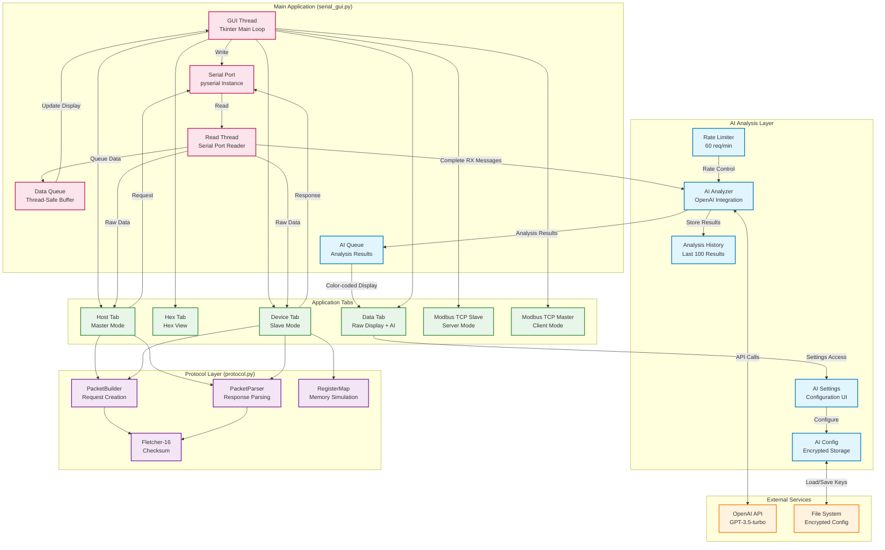
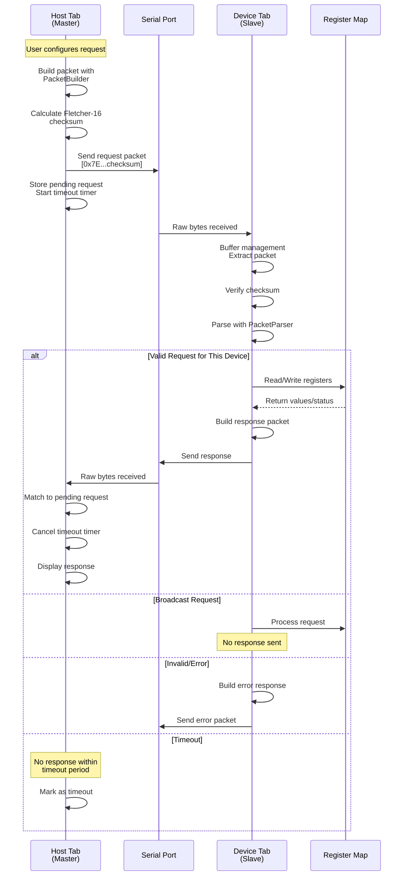
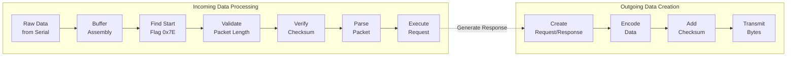
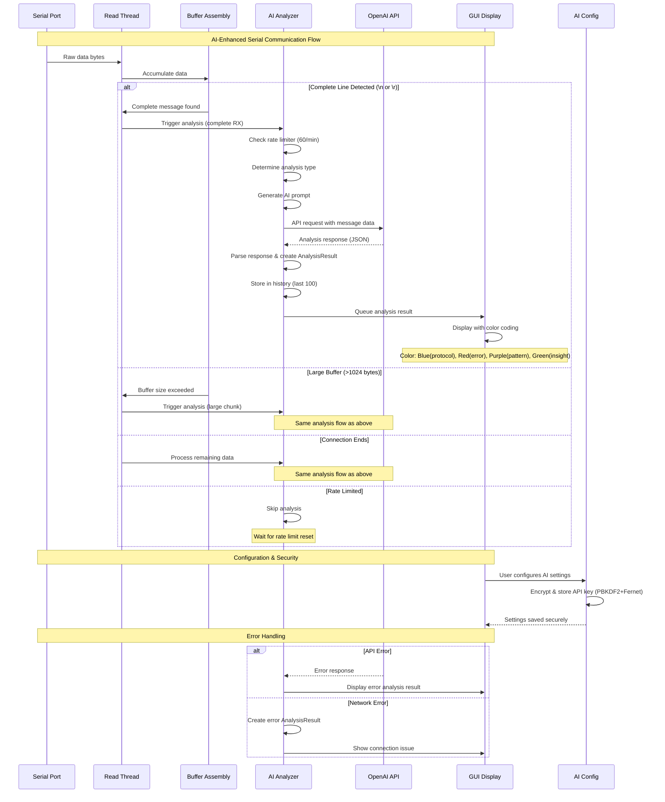
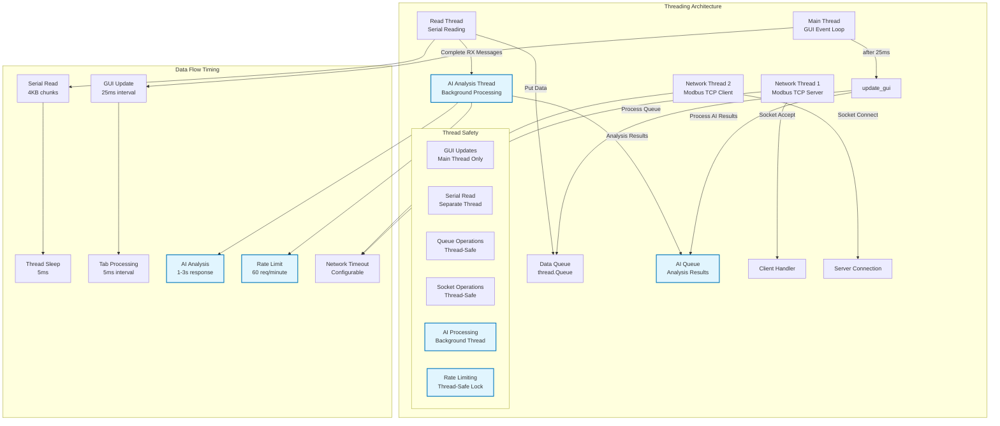
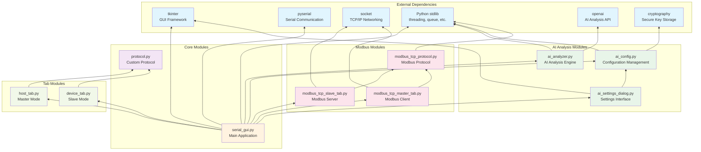

# SerialCOM Tool - Professional Serial & Network Communication Suite


A comprehensive cross-platform communication tool for serial and network protocols with AI-powered analysis, featuring advanced debugging capabilities for embedded systems development and testing.

## 🎯 **Current Status: Version 4.3.0**
**Latest Features**: OpenAI-powered serial communication analysis, intelligent pattern recognition, and complete project reorganization for enhanced developer experience.

## Table of Contents
- [Overview](#overview)
- [Key Features](#key-features)
- [Screenshots](#screenshots)
- [Installation](#installation)
- [Quick Start](#quick-start)
- [Communication Protocols](#communication-protocols)
  - [Serial Communication](#serial-communication)
  - [Custom Protocol](#custom-protocol)
  - [Modbus TCP](#modbus-tcp)
- [Usage Guide](#usage-guide)
- [Testing](#testing)
- [Architecture](#architecture)
- [Development](#development)
- [Troubleshooting](#troubleshooting)
- [License](#license)

## Overview

SerialCOM Tool is a professional-grade communication suite designed for engineers and developers working with embedded systems, industrial automation, and IoT devices. It provides a unified interface for multiple communication protocols with real-time monitoring, data logging, and protocol analysis capabilities.

## Key Features

### Core Capabilities
- **🤖 AI-Powered Analysis**: OpenAI GPT-3.5-turbo integration for intelligent serial communication analysis
- **Multi-Protocol Support**: Serial, Custom Register-based Protocol, Modbus TCP
- **Cross-Platform**: Native support for Windows, macOS, and Linux
- **Real-Time Monitoring**: Live data visualization with hex/ASCII views and AI insights
- **Non-Blocking I/O**: Responsive GUI during all operations
- **Data Logging**: Timestamped CSV export for analysis
- **Protocol Analysis**: Packet inspection, checksum verification, error detection
- **🔒 Secure Configuration**: Encrypted API key storage with PBKDF2 + Fernet encryption

### Communication Features
- **Serial Communication**: Full RS-232/485 support with hardware flow control
- **Master/Slave Modes**: Act as either host (master) or device (slave)
- **Modbus TCP**: Server and client implementation with 16-bit register support
- **Error Simulation**: Test error handling and edge cases
- **Broadcast Support**: One-to-many communication capability
- **Timeout Management**: Configurable timeouts with automatic retry

### User Interface
- **Tabbed Interface**: Organized workspace for different protocols
- **Color-Coded Display**: Visual differentiation of data types and packet components
- **AI Analysis Integration**: OpenAI-powered intelligent analysis of serial communication data
- **Search Functionality**: Quick data location in logs and registers
- **Command History**: Arrow-key navigation through previous commands
- **Auto-Scroll Control**: Manageable real-time data streams
- **Responsive Design**: Optimized layout for various screen sizes

## Screenshots

### Data Display Tab

*Real-time serial communication with hex/ASCII views and command history*

### Host (Master) Mode
.png)
*Send register commands with packet preview and response monitoring*

### Device (Slave) Mode
.png)
*Simulate devices with configurable register maps and error simulation*

### Modbus TCP Slave

*TCP server for Modbus communication with register management*

### Modbus TCP Master

*TCP client for sending Modbus requests with real-time packet preview*

## Installation

### Prerequisites
- Python 3.7 or higher
- tkinter (usually included with Python)
- pyserial library
- openai library (for AI analysis features)
- cryptography library (for secure API key storage)

### Setup Instructions

#### Method 1: Using Virtual Environment (Recommended)

**Step 1: Clone the repository**
```bash
git clone <repository-url>
cd SerialCOM_Tool
```

**Step 2: Create and activate virtual environment**

**Windows:**
```bash
# Create virtual environment
python -m venv venv

# Activate virtual environment
venv\Scripts\activate

# You should see (venv) in your command prompt
```

**macOS/Linux:**
```bash
# Create virtual environment
python3 -m venv venv

# Activate virtual environment
source venv/bin/activate

# You should see (venv) in your terminal prompt
```

**Step 3: Install dependencies**
```bash
# With virtual environment activated
pip install -r requirements.txt
```

**Step 4: Run the application**
```bash
# With virtual environment activated
python serial_gui.py
```

**Step 5: Deactivate virtual environment (when done)**
```bash
deactivate
```

#### Method 2: System-wide Installation (Alternative)

1. **Clone the repository**
   ```bash
   git clone <repository-url>
   cd SerialCOM_Tool
   ```

2. **Install dependencies**
   ```bash
   pip install -r requirements.txt
   ```

3. **Run the application**
   ```bash
   python serial_gui.py
   ```

### Virtual Environment Benefits

Using a virtual environment provides several advantages:

- **Isolation**: Dependencies are isolated from your system Python
- **Reproducibility**: Consistent environment across different machines
- **Version Control**: Specific package versions without conflicts
- **Clean Uninstall**: Easy to remove by deleting the venv folder
- **Multiple Projects**: Different Python environments for different projects

### Setting Up on Different Computers

When cloning this project on a new computer, follow these steps:

**1. First-time setup on new machine:**
```bash
# Clone the repository
git clone <repository-url>
cd SerialCOM_Tool

# Create virtual environment
python -m venv venv  # Windows
python3 -m venv venv  # macOS/Linux

# Activate virtual environment
venv\Scripts\activate  # Windows
source venv/bin/activate  # macOS/Linux

# Install dependencies
pip install -r requirements.txt

# Run the application
python serial_gui.py
```

**2. Daily usage (after initial setup):**
```bash
# Navigate to project directory
cd SerialCOM_Tool

# Activate virtual environment
venv\Scripts\activate  # Windows
source venv/bin/activate  # macOS/Linux

# Run the application
python serial_gui.py

# When finished, deactivate
deactivate
```

**3. Updating dependencies:**
```bash
# With virtual environment activated
pip install -r requirements.txt --upgrade
```

### Troubleshooting Virtual Environment

**Virtual environment not found:**
- Ensure you're in the correct project directory
- Recreate the virtual environment if needed

**Permission errors:**
- On Linux/macOS: Use `python3` instead of `python`
- On Windows: Run command prompt as administrator if needed

**Package installation fails:**
- Update pip: `pip install --upgrade pip`
- Use specific Python version: `python3.8 -m venv venv`

### Modbus TCP Troubleshooting

**WinError 10049 - "The requested address is not valid in its context":**
- This occurs when trying to bind to an IP address not assigned to your computer
- Use the IP dropdown to select a valid address:
  - `0.0.0.0` - Bind to all interfaces (recommended)
  - `127.0.0.1` - Bind to localhost only
  - Or select one of your actual network IPs
- Avoid APIPA addresses (169.254.x.x range)

**Client connects then immediately disconnects:**
- This is normal for many Modbus clients using connection-per-transaction mode
- Check Statistics section for request/response counts to verify communication
- Use Debug logging to see detailed connection information
- External Modbus masters often connect, send request, receive response, then disconnect

### Platform-Specific Requirements

**Linux**
```bash
# Add user to dialout group for serial port access
sudo usermod -a -G dialout $USER
# Install tkinter if needed
sudo apt-get install python3-tk
# Install socat for virtual ports (optional)
sudo apt-get install socat
```

**macOS**
```bash
# Install socat for virtual ports (optional)
brew install socat
```

**Windows**
- No additional setup required
- For virtual ports, install com0com or similar

## Quick Start

### Basic Serial Communication

1. **Connect to a device**
   - Select port from dropdown
   - Choose baud rate (default: 9600)
   - Configure data bits, parity, stop bits
   - Click "Connect"

2. **Send and receive data**
   - Type commands in input field
   - Press Enter or click Send
   - View responses in real-time

### Protocol Testing

1. **As Master (Host)**
   - Switch to "Host (Master)" tab
   - Set device address (1-247)
   - Select operation (Read/Write)
   - Enter register address and values
   - Send request and monitor response

2. **As Slave (Device)**
   - Switch to "Device (Slave)" tab
   - Configure device address
   - Load test pattern or set registers
   - Monitor incoming requests
   - View automatic responses

## AI Analysis Features

### OpenAI Integration
SerialCOM Tool includes intelligent analysis capabilities powered by OpenAI's GPT models to help debug and understand serial communication patterns.

#### Key Features
- **Real-time Analysis**: Automatic analysis of complete RX messages
- **Protocol Detection**: Identifies communication protocols and patterns
- **Error Analysis**: Detects and explains communication errors
- **Pattern Recognition**: Identifies data structures and repetitive patterns
- **Smart Suggestions**: Provides actionable debugging recommendations
- **Secure API Key Storage**: Encrypted storage of API credentials

#### Analysis Types
- **Protocol Analysis**: Identifies packet structures, checksums, and protocol compliance
- **Error Detection**: Finds malformed packets, timing issues, and protocol violations
- **Pattern Recognition**: Detects command-response sequences and data relationships
- **General Insights**: Provides context for unknown or custom protocols

#### Configuration
1. **API Key Setup**: Navigate to Data Display tab and click "AI Settings"
2. **Enter OpenAI API Key**: Provide your OpenAI API key for analysis
3. **Configure Analysis**: Adjust analysis types and rate limits
4. **Enable Analysis**: Toggle "Enable AI Analysis" to start automatic analysis

#### Analysis Triggers
- **Complete RX Messages**: Triggers after complete lines (ending with \n or \r)
- **Large Data Blocks**: Analyzes buffers exceeding 1024 bytes
- **Connection End**: Processes remaining data when disconnecting

#### Visual Feedback
- **Color-coded Results**: Different colors for protocol, error, pattern, and insight analysis
- **Real-time Display**: Analysis appears alongside communication data
- **Status Indicators**: Shows analysis progress and API status

## Communication Protocols

### Serial Communication

Standard RS-232/485 serial communication with:
- Baud rates: 300 to 921600
- Data bits: 5, 6, 7, 8
- Parity: None, Even, Odd, Mark, Space
- Stop bits: 1, 1.5, 2
- Flow control: None, RTS/CTS, XON/XOFF

### Custom Protocol

Frame-based protocol for register operations:

#### Packet Structure
```
[Start Flag][Device Addr][Message ID][Length][Data][Checksum]
   0x7E        1 byte      1 byte    1 byte   N     2 bytes
```

#### Function Codes
| Code | Function | Description |
|------|----------|-------------|
| 0x01 | Read Single | Read one 16-bit register |
| 0x02 | Write Single | Write one 16-bit register |
| 0x03 | Read Multiple | Read up to 255 registers |
| 0x04 | Write Multiple | Write up to 127 registers |

#### Error Codes
| Code | Description |
|------|-------------|
| 0x01 | Invalid function |
| 0x02 | Invalid address |
| 0x03 | Invalid value |
| 0xFF | Internal error |

### Modbus TCP

#### Overview
Industry-standard Modbus TCP/IP implementation focusing on holding register operations.

#### Supported Functions
- **Function 0x03**: Read Holding Registers
- **Function 0x10**: Write Multiple Registers

#### Frame Format
```
[Transaction ID][Protocol ID][Length][Unit ID][Function][Data]
    2 bytes        2 bytes    2 bytes  1 byte   1 byte    N
```

#### Slave Configuration
1. Navigate to "Modbus TCP Slave" tab
2. Select IP address from dropdown:
   - `0.0.0.0` - Listen on all network interfaces (recommended for testing)
   - `127.0.0.1` - Listen on localhost only
   - Or select one of your actual network IPs
3. Set port (default: 502)
4. Configure Unit ID (1-247)
5. Click "Start Server"
6. Manage registers:
   - Set individual values
   - Load test patterns (187 realistic power supply registers)
   - Export to CSV

#### Master Configuration
1. Navigate to "Modbus TCP Master" tab
2. Enter server IP and port
3. Set Unit ID
4. Click "Connect"
5. Send requests:
   - Read: Specify address and count
   - Write: Provide address and hex values

#### Testing Example
```python
# Master: Read 10 registers starting at address 0
Address: 0000
Count: 10

# Master: Write 3 registers starting at address 16
Address: 0010
Values: AAAA,BBBB,CCCC
```

## Usage Guide

### Virtual Port Testing

Create virtual serial port pairs for testing without hardware:

**Linux/macOS**
```bash
# Create virtual ports
./create_ports.sh

# Terminal 1: Run as Device
python serial_gui.py
# Connect to /dev/ttys006

# Terminal 2: Run as Host
python serial_gui.py
# Connect to /dev/ttys007
```

**Windows**
Use com0com to create virtual COM port pairs (e.g., COM10 ↔ COM11)

### Data Logging

1. Enable logging in Data Display tab
2. Logs saved to `logs/` directory
3. Format: `serial_log_YYYYMMDD_HHMMSS.csv`
4. Includes timestamps, direction, and data

### Register Management

**Setting Registers**
- Single: Enter address and value, click "Set"
- Multiple: Use comma-separated values
- Pattern: Click "Load Test Pattern"
- Clear: Click "Clear All"

**Exporting Data**
- Click "Export CSV" in Device tab
- Saves current register map
- Includes address and value columns

## Testing

### Unit Tests

**Protocol Testing**
```bash
python test_protocol.py
```
Validates:
- Checksum calculation
- Packet encoding/decoding
- Register operations
- Error responses

**Modbus TCP Testing**
```bash
python test_modbus_tcp.py
```
Validates:
- Frame construction
- Function code handling
- Exception responses
- Protocol compliance

**Port Detection**
```bash
python test_port_detection.py
```

### Manual Testing Scenarios

1. **Basic Communication**
   - Send ASCII text
   - Send hex values
   - Verify echo response

2. **Protocol Operations**
   - Read single register
   - Write multiple registers
   - Test broadcast mode
   - Simulate errors

3. **Modbus TCP**
   - Read holding registers
   - Write multiple registers
   - Test timeout handling
   - Verify exception codes

## Architecture

### Project Structure
```
SerialCOM_Tool/
├── README.md                     # This documentation
├── CHANGELOG.md                  # Detailed version history & features
├── requirements.txt              # Python dependencies
├── serial_gui.py                 # Main application (renamed from main_application.py)
├── protocol.py                   # Custom protocol (renamed from custom_protocol.py)
├── host_tab.py                   # Master mode implementation
├── device_tab.py                 # Slave mode implementation
├── modbus_tcp_protocol.py        # Modbus TCP frame handling
├── modbus_tcp_slave_tab.py       # TCP server with responsive 4-column layout
├── modbus_tcp_master_tab.py      # TCP client implementation
├── ai_analyzer.py                # 🤖 AI analysis engine with OpenAI integration
├── ai_config.py                  # 🔒 Secure API key management & configuration
├── ai_settings_dialog.py         # AI settings user interface
├── ui_styles.py                  # Comprehensive UI styling system
├── channel_register_map.py       # Register mapping utilities
├── testScript/                   # 📁 Consolidated test files (25 scripts)
│   ├── test_protocol.py          # Custom protocol validation
│   ├── test_modbus_tcp.py        # Modbus TCP testing
│   ├── test_ai_integration.py    # AI analysis testing
│   ├── verify_*.py               # Verification scripts
│   ├── debug_*.py                # Debug utilities
│   └── setup_*.py                # Configuration helpers
├── image/                        # UI assets and screenshots
└── virtual_ports.sh              # Virtual port creation script
```

### System Architecture Overview



### Protocol Communication Flow



### Packet Processing Pipeline



### AI Analysis Flow



### Threading Model & Synchronization



### Module Dependencies



### Component Responsibilities

#### Main Application (serial_gui.py)
- **GUI Management**: Creates and manages the main window and notebook tabs
- **Serial Port Management**: Handles port detection, connection, and disconnection
- **Thread Management**: Creates and manages read thread for serial data
- **Data Routing**: Routes incoming data to appropriate tabs
- **Configuration**: Manages serial port settings (baud rate, parity, etc.)

#### Protocol Layer (protocol.py)
- **PacketBuilder**: Constructs request packets with proper formatting
- **PacketParser**: Validates and parses incoming packets
- **Fletcher16**: Implements checksum calculation and verification
- **RegisterMap**: Simulates device memory with 16-bit registers
- **Error Handling**: Defines error codes and exception responses

#### Host Tab (host_tab.py)
- **Request Builder**: UI for configuring read/write operations
- **Packet Preview**: Real-time packet visualization
- **Response Handler**: Processes and displays responses
- **Timeout Management**: Tracks pending requests and timeouts
- **Statistics**: Maintains communication metrics

#### Device Tab (device_tab.py)
- **Request Processing**: Handles incoming requests
- **Response Generation**: Creates appropriate responses
- **Register Management**: UI for register manipulation
- **Error Simulation**: Testing error conditions
- **Logging**: Maintains request/response logs

#### Modbus TCP Modules
- **modbus_tcp_protocol.py**: Core Modbus frame handling
- **modbus_tcp_slave_tab.py**: TCP server implementation
- **modbus_tcp_master_tab.py**: TCP client implementation

### Data Flow Details

1. **Serial Reception Path**
   ```
   Physical Port → pyserial → Read Thread → Queue → GUI Update → Tab Processing
   ```

2. **Serial Transmission Path**
   ```
   User Input → Tab Handler → Protocol Encoder → pyserial → Physical Port
   ```

3. **Network Reception Path (Modbus)**
   ```
   TCP Socket → Network Thread → Frame Parser → Register Operation → Response
   ```

4. **Network Transmission Path (Modbus)**
   ```
   User Input → Frame Builder → TCP Socket → Network
   ```

### Critical Implementation Details

#### Thread Safety
- All GUI updates must occur in the main thread
- Queue.Queue used for thread-safe data passing
- No direct serial port access from GUI callbacks
- Socket operations handled in separate threads

#### Buffer Management
- 4KB read buffer for serial operations
- Circular buffer pattern for packet assembly
- Start flag (0x7E) detection for packet boundaries
- Timeout-based buffer clearing for incomplete packets

#### Error Recovery
- Automatic reconnection on serial errors
- Graceful handling of port disconnection
- Timeout recovery for pending requests
- Exception catching at all I/O boundaries

#### Performance Optimization
- 25ms GUI update interval (40 FPS)
- 5ms serial read polling
- Batch GUI updates to prevent flicker
- Lazy tab updates (only active tab)
- Efficient packet search algorithms

## Development

### Adding New Protocols

1. **Create protocol module**
   ```python
   class NewProtocol:
       def encode(self, data):
           # Encoding logic
       def decode(self, data):
           # Decoding logic
   ```

2. **Implement GUI tab**
   ```python
   class NewProtocolTab(ttk.Frame):
       def __init__(self, parent):
           # GUI setup
   ```

3. **Register in main application**
   ```python
   self.notebook.add(NewProtocolTab(self.notebook), text="New Protocol")
   ```

### Code Style
- PEP 8 compliance
- Type hints for parameters
- Docstrings for public methods
- Exception handling
- Resource cleanup

## Troubleshooting

### Common Issues

**Port Access Denied**
- Linux: Add user to dialout group
- Windows: Check COM port availability
- macOS: Verify port permissions

**Connection Failed**
- Check cable connections
- Verify baud rate settings
- Confirm port selection
- Test with loopback

**Missing Data**
- Verify timeout settings
- Check buffer sizes
- Enable auto-scroll
- Review data format

**Modbus TCP Issues**
- Confirm network connectivity
- Check firewall settings
- Verify Unit ID match
- Use IP dropdown to select valid binding address
- Check debug messages in Communication Log
- Test with known good client/server

### Debug Mode

Enable detailed logging:
```python
import logging
logging.basicConfig(level=logging.DEBUG)
```

### Performance Tuning
- GUI refresh: 25ms intervals
- Serial polling: 5ms delay
- Buffer size: 4KB default
- Timeout: Configurable per operation

## Contributing

1. Fork the repository
2. Create feature branch
3. Add comprehensive tests
4. Ensure code quality
5. Submit pull request

## Building Standalone Windows Executable

This section explains how to create a standalone `.exe` file that runs on any Windows computer without requiring Python installation.

### What is a Standalone Executable?

A standalone executable (`.exe` file) packages your Python application with all its dependencies into a single file that can run on any Windows computer. Users don't need to install Python, libraries, or any other software - they just double-click the `.exe` file to run your application.

### Prerequisites for Building

Before building, ensure you have:
1. **Python installed** on your development computer (the one you're using to build)
2. **The application working** when you run `python serial_gui.py`
3. **All dependencies installed** via `pip install -r requirements.txt`

### Step-by-Step Build Instructions

#### Step 1: Verify Your Python Environment

Open Command Prompt or PowerShell and check that Python is installed:

```bash
python --version
```

You should see something like `Python 3.12.10`. If you get an error, install Python first from [python.org](https://python.org).

#### Step 2: Install PyInstaller

PyInstaller is the tool that creates the executable. Install it with pip:

```bash
pip install pyinstaller
```

This downloads and installs PyInstaller and its dependencies. You should see "Successfully installed pyinstaller" when complete.

#### Step 3: Navigate to Your Project Folder

Use the `cd` command to go to your SerialCOM_Tool folder:

```bash
cd C:\SerialCOM_Tool
```

Make sure you're in the folder containing `serial_gui.py`.

#### Step 4: Build the Executable

Run this command to create the standalone executable:

```bash
pyinstaller --onefile --windowed --name "SerialCOM_Tool" --add-data "image/*;image" --hidden-import serial --hidden-import serial.tools --hidden-import serial.tools.list_ports --hidden-import serial.tools.list_ports_windows serial_gui.py
```

**What each option means:**
- `--onefile`: Creates a single .exe file instead of a folder with many files
- `--windowed`: Runs without showing a console window (GUI only)
- `--name "SerialCOM_Tool"`: Names the executable SerialCOM_Tool.exe
- `--add-data "image/*;image"`: Includes the image folder with icons
- `--hidden-import serial...`: Ensures PySerial modules are included
- `serial_gui.py`: The main Python file to convert

#### Step 5: Wait for Build to Complete

The build process takes 1-2 minutes. You'll see many lines of output ending with:
```
Building EXE from EXE-00.toc completed successfully.
```

#### Step 6: Find Your Executable

After building, you'll have these new folders:
- `build/` - Temporary build files (you can delete this)
- `dist/` - **Contains your SerialCOM_Tool.exe file**
- `SerialCOM_Tool.spec` - Build configuration (keep for rebuilding)

Your executable is in the `dist` folder:
```
C:\SerialCOM_Tool\dist\SerialCOM_Tool.exe
```

#### Step 7: Test the Executable

1. Navigate to the `dist` folder
2. Double-click `SerialCOM_Tool.exe`
3. The application should start without any Python installation

### Distributing Your Application

To share your application with others:

1. **Copy the single file** `dist\SerialCOM_Tool.exe` to any Windows computer
2. **No installation needed** - users just double-click to run
3. **File size** is approximately 10-12 MB (includes Python and all libraries)

### Troubleshooting Build Issues

#### "Module not found" error when running the .exe

If the executable shows errors about missing modules:

1. Make sure you installed all dependencies first:
   ```bash
   pip install pyserial
   ```

2. Rebuild with explicit imports:
   ```bash
   pyinstaller --onefile --windowed --hidden-import serial --hidden-import tkinter serial_gui.py
   ```

#### Antivirus warnings

Some antivirus software may flag PyInstaller executables. This is a false positive because:
- PyInstaller packages code in an unusual way
- The executable is unsigned

Solutions:
- Add an exception in your antivirus
- Sign the executable with a code signing certificate (advanced)

#### Executable is too large

The single-file executable includes the entire Python interpreter. To reduce size:
- Use `--onedir` instead of `--onefile` (creates a folder with multiple files)
- Use UPX compression (add `--upx-dir` option if UPX is installed)

### Rebuilding After Changes

When you modify your Python code:

1. Make your code changes
2. Test with `python serial_gui.py`
3. Rebuild the executable using the same PyInstaller command
4. The new .exe replaces the old one in the `dist` folder

### Advanced: Using a Spec File

For complex builds, you can use a spec file for consistent builds:

1. PyInstaller creates `SerialCOM_Tool.spec` automatically
2. Edit this file to customize the build
3. Rebuild using: `pyinstaller SerialCOM_Tool.spec`

### What Gets Included in the Executable

The standalone executable contains:
- **Python interpreter** (about 5 MB)
- **Your application code** (all .py files)
- **Python standard library** (tkinter, threading, etc.)
- **Third-party libraries** (pyserial)
- **Resource files** (images in the image/ folder)
- **Windows runtime files** (required DLLs)

Everything is compressed into a single file that self-extracts when run.

### Platform Notes

- **This executable only works on Windows** (for macOS/Linux, build on those platforms)
- **Windows version compatibility**: Works on Windows 7 and later
- **No administrator rights needed** to run the executable
- **Portable**: Can run from USB drive or network share

## License

MIT License - See LICENSE file for details

## Support

For issues or questions:
- Create an issue in the repository
- Review troubleshooting section
- Check existing documentation

---

**Version 4.3** | **Last Updated: August 2025**